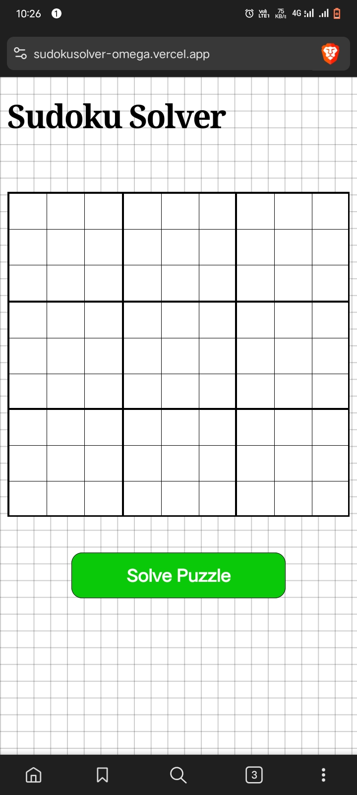
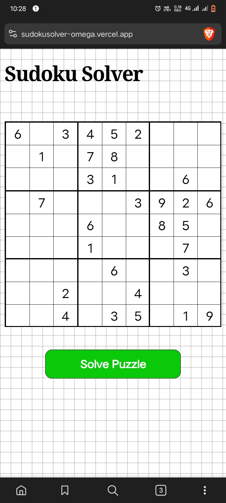
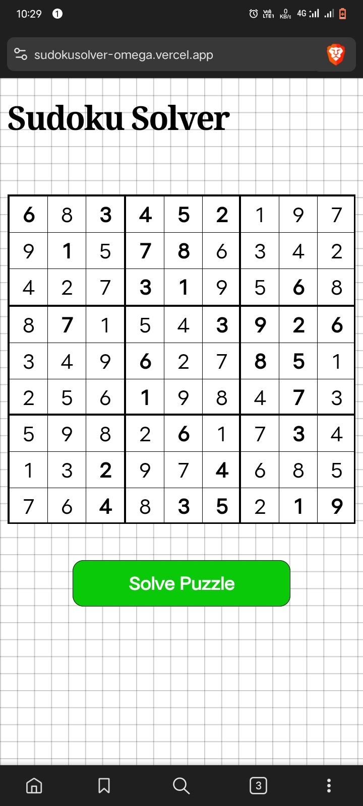

# 🔢 Sudoku Solver

Sudoku Solver is a web-based tool that helps you solve Sudoku puzzles instantly. Built using **Astro** and **React**, it provides a fast and interactive experience for solving Sudoku grids.

## Link

[sukodu solver](https://sudokusolver-omega.vercel.app/)

## ✨ Features

-   **Instant Solving**: Automatically solves Sudoku puzzles in real time.
-   **User Input**: Enter your own puzzles to get a solution.
-   **Interactive UI**: Clean and responsive interface.
-   **Fast & Efficient**

## 🛠 Tech Stack

-   **Frontend**: Astro, React
-   **State Management**: React hooks
-   **Styling**: CSS

## 📌 Usage

1. Enter the Sudoku puzzle into the provided grid.
2. Click the **Solve** button to get the solution.
3. View the solved Sudoku instantly!

## 🎯 Roadmap

-   [ ] Add difficulty levels
-   [ ] Implement a Sudoku puzzle generator
-   [ ] Improve UI/UX

## 🤝 Contributing

Feel free to submit **issues**, or **feature requests** to improve Sudoku Solver!

